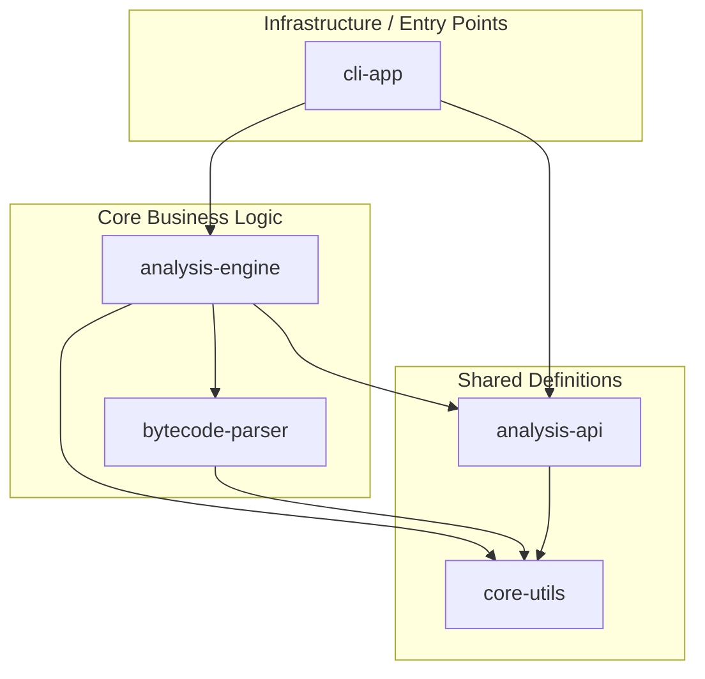

# Architektur-Dokumentation

Dieses Dokument beschreibt die technische Architektur von **JByteInspector**.

## Übersicht

JByteInspector folgt einer **Clean Architecture** (Zwiebel-Architektur), bei der Abhängigkeiten strikt von außen nach
innen (oder von oben nach unten in einer Schichten-Sicht) verlaufen. Das Ziel ist eine hohe Wartbarkeit, Testbarkeit und
Austauschbarkeit von Komponenten.

Das Projekt nutzt das **Java Platform Module System (JPMS)**, um diese Grenzen auch zur Laufzeit und Compile-Zeit zu
erzwingen.

## Modul-Abhängigkeitsgraph

## Modul-Details

### 1. core-utils

**Verantwortung:** Basisfunktionalitäten, die projektweit benötigt werden, aber kein Domänenwissen enthalten.

* **Inhalt:** `FileUtils` (Directory Walking), String-Helper, Logging-Konfiguration.
* **Abhängigkeiten:** Keine (außer JDK).

### 2. bytecode-parser

**Verantwortung:** Das technische Lesen und Verstehen des `.class`-Dateiformats.

* **Inhalt:**
    * `classfile`: Repräsentation der rohen binären Strukturen (`ClassFile`, `constant_pool`, `access_flags`).
    * `model`: (Optional) Leicht abstrahierte Modelle.
* **Design:** Rein datengetrieben. Wirft Exceptions bei ungültigem Bytecode.
* **Abhängigkeiten:** `core-utils`.

### 3. analysis-api

**Verantwortung:** Definition der Schnittstelle nach außen. Dies ist der "Vertrag", den Clients (CLI, GUI) nutzen.

* **Inhalt:**
    * `AnalysisService` (Interface).
    * `ClassReport`, `MethodReport` (Java Records).
* **Design:** Nutzung von **Java Records** für unveränderliche, transparente Datentransferobjekte (DTOs).

### 4. analysis-engine

**Verantwortung:** Die Implementierung der Geschäftslogik. Hier wird der Parser aufgerufen und die Rohdaten in nützliche
Reports umgewandelt.

* **Inhalt:** `JByteInspectorEngine` (Implementierung von `AnalysisService`).
* **Abhängigkeiten:** `analysis-api`, `bytecode-parser`, `core-utils`.

### 5. cli-app

**Verantwortung:** Interaktion mit dem Benutzer. Validierung von Eingabeparametern und Formatierung der Ausgabe.

* **Inhalt:** `Main.java`.
* **Abhängigkeiten:** `analysis-engine` (Runtime), `analysis-api` (Compile-time).

## Technische Entscheidungen

### Warum Java 25?

Wir nutzen Java 25, um Zugriff auf die neuesten Sprachfeatures zu haben und langfristig auf einer modernen Basis
aufzubauen. Insbesondere Pattern Matching und Records erleichtern die Arbeit mit den komplexen Strukturen des Bytecodes
erheblich.

### Warum JPMS (Modules)?

JPMS erzwingt, dass interne Pakete (z. B. die Parser-Internals) nicht versehentlich von der API oder der CLI genutzt
werden. Nur was explizit `exported` ist, ist sichtbar. Das verhindert "Spaghetti-Code".

### Datenmodell

Wir trennen strikt zwischen:

1. **ClassFile (Parser):** Spiegelt 1:1 die binäre Struktur wider (Indices, Offsets).
2. **ClassReport (API):** Eine menschenlesbare, aufgelöste Struktur (Strings statt Indices, Enums statt Bitmasken).

Diese Trennung erlaubt es uns, den Parser später auszutauschen oder zu optimieren, ohne die API für Konsumenten zu
brechen.
